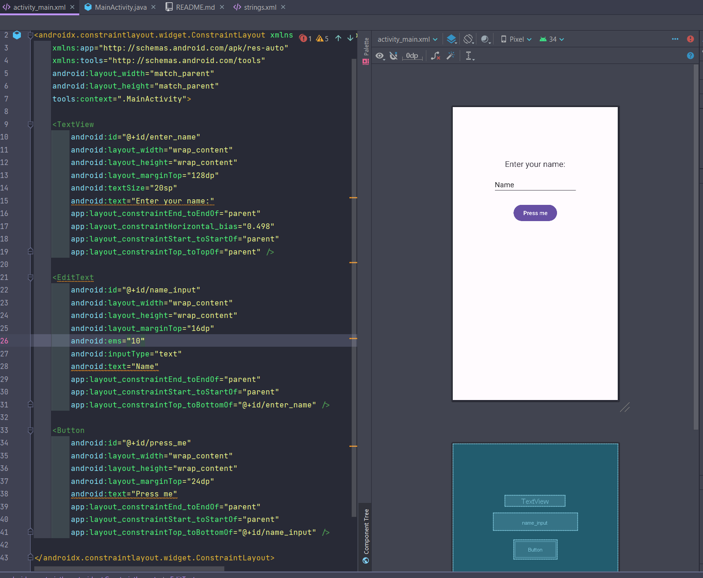
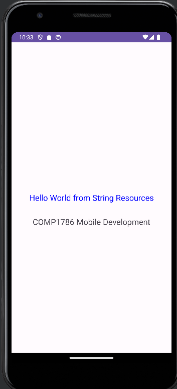

# Create GUI 

To create layout, we must use `activity_main.xml`. The following code can be added

```xml
<?xml version="1.0" encoding="utf-8"?>
<androidx.constraintlayout.widget.ConstraintLayout xmlns:android="http://schemas.android.com/apk/res/android"
    xmlns:app="http://schemas.android.com/apk/res-auto"
    xmlns:tools="http://schemas.android.com/tools"
    android:layout_width="match_parent"
    android:layout_height="match_parent"
    tools:context=".MainActivity">

    <TextView
        android:id="@+id/enter_name"
        android:layout_width="wrap_content"
        android:layout_height="wrap_content"
        android:layout_marginTop="128dp"
        android:textSize="20sp"
        android:text="Enter your name:"
        app:layout_constraintEnd_toEndOf="parent"
        app:layout_constraintHorizontal_bias="0.498"
        app:layout_constraintStart_toStartOf="parent"
        app:layout_constraintTop_toTopOf="parent" />

    <EditText
        android:id="@+id/name_input"
        android:layout_width="wrap_content"
        android:layout_height="wrap_content"
        android:layout_marginTop="16dp"
        android:ems="10"
        android:inputType="text"
        android:text="Name"
        app:layout_constraintEnd_toEndOf="parent"
        app:layout_constraintStart_toStartOf="parent"
        app:layout_constraintTop_toBottomOf="@+id/enter_name" />

    <Button
        android:id="@+id/press_me"
        android:layout_width="wrap_content"
        android:layout_height="wrap_content"
        android:layout_marginTop="24dp"
        android:text="Press me"
        app:layout_constraintEnd_toEndOf="parent"
        app:layout_constraintStart_toStartOf="parent"
        app:layout_constraintTop_toBottomOf="@+id/name_input" />

</androidx.constraintlayout.widget.ConstraintLayout>
```

It can produce the following UI



# Adding behavior

We can add the button behavior to set the text

```java
public class MainActivity extends AppCompatActivity {

    EditText nameInput;
    Button pressMeBtn;

    @Override
    protected void onCreate(Bundle savedInstanceState) {
        super.onCreate(savedInstanceState);
        setContentView(R.layout.activity_main);

        nameInput = findViewById(R.id.name_input);
        pressMeBtn = findViewById(R.id.press_me);

        pressMeBtn.setOnClickListener(new View.OnClickListener() {
            @Override
            public void onClick(View view) {
                nameInput.setText("The button was pressed ...");
            }
        });
    }
}
```

The app can be seen as below:



# Adding new activity

Here, we will add 2nd activity named `NameDisplay`. We can follow instructions to create it

Choose `Gallery`


Then, choose `Empty Views Activity`


Enter information of new Activity


Then, new Activity `NameDisplay` is added


We can add layout for Activity `NameDisplay` with modifuing `activity_name_display.xml`


```xml
<?xml version="1.0" encoding="utf-8"?>
<androidx.constraintlayout.widget.ConstraintLayout xmlns:android="http://schemas.android.com/apk/res/android"
    xmlns:app="http://schemas.android.com/apk/res-auto"
    xmlns:tools="http://schemas.android.com/tools"
    android:layout_width="match_parent"
    android:layout_height="match_parent"
    tools:context=".NameDisplay">

    <TextView
        android:id="@+id/name_display"
        android:layout_width="wrap_content"
        android:layout_height="wrap_content"
        android:layout_marginTop="256dp"
        android:text="Name Display"
        android:textSize="20sp"
        app:layout_constraintEnd_toEndOf="parent"
        app:layout_constraintStart_toStartOf="parent"
        app:layout_constraintTop_toTopOf="parent" />
</androidx.constraintlayout.widget.ConstraintLayout>
```

After that, we can modify `MainActivity.java` to send `name` value to `NameDisplay.java`
`MainActivity.java`
```java
public class MainActivity extends AppCompatActivity {
    EditText nameInput;
    Button pressMeBtn;

    @Override
    protected void onCreate(Bundle savedInstanceState) {
        super.onCreate(savedInstanceState);
        setContentView(R.layout.activity_main);

        nameInput = findViewById(R.id.name_input);
        pressMeBtn = findViewById(R.id.press_me);
        Intent i = new Intent(this, NameDisplay.class);


        pressMeBtn.setOnClickListener(new View.OnClickListener() {
            @Override
            public void onClick(View view) {
                // Get name from nameInput
                String name = nameInput.getText().toString();
                // Put value of name into extra
                i.putExtra(NameDisplay.NAME, name);

                // Start NameDisplay activity
                startActivity(i);

            }
        });
    }
}
```

On `NameDisplay.java`, we will receive the `name` value from `extras` then display it. 

```java
public class NameDisplay extends AppCompatActivity {
    public static final String NAME = "name";
    TextView nameDisplay;

    @Override
    protected void onCreate(Bundle savedInstanceState) {
        super.onCreate(savedInstanceState);
        setContentView(R.layout.activity_name_display);

        nameDisplay = findViewById(R.id.name_display);

        Bundle extras = getIntent().getExtras();

        if (extras == null) {
            nameDisplay.setTextColor(Color.RED);
            nameDisplay.setText("ERROR ...");
            return;
        }

        String name = extras.getString(NAME);

        if (name.trim().isEmpty()) {
            nameDisplay.setTextColor(Color.RED);
            nameDisplay.setText("Name should not be empty");
            return;
        }

        nameDisplay.setTextColor(Color.BLUE);
        nameDisplay.setText("Hello " + name);
    }
}
```

The final app can be seen as below:


